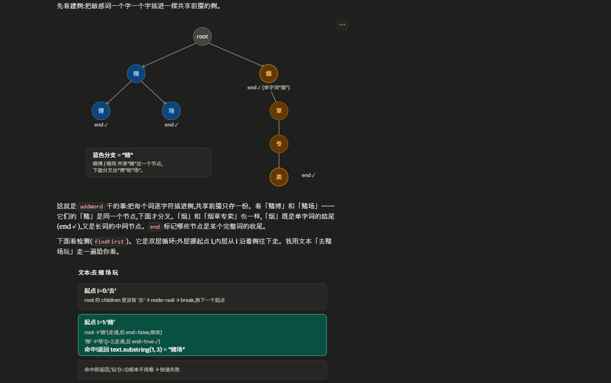

~~开发日志

第一天：

错误代码设计： 200 成功

40xxx：客户端错误
50xxx：服务器错误
60xxx：业务类错误

    SUCCESS(200, "OK"),

    PARAM_INVALID(40001, "参数无效"),
    UNAUTHORIZED(40101, "未授权"),
    API_KEY_INVALID(40102, "API Key 无效"),
    SIGN_INVALID(40103, "签名校验失败"),
    TIMESTAMP_EXPIRED(40104, "请求时间戳过期"),
    FORBIDDEN(40301, "权限不足"),
    NOT_FOUND(40401, "资源不存在"),

    SERVER_ERROR(50001, "服务器内部错误"),
    SERVICE_UNAVAILABLE(50301, "服务不可用"),

    APP_NOT_FOUND(60001, "应用不存在"),
    APP_DISABLED(60002, "应用已停用"),
    QUOTA_EXCEEDED(60003, "配额已用尽"),
    TEMPLATE_NOT_FOUND(60101, "模板不存在"),
    SENSITIVE_WORD_DETECTED(60201, "内容包含敏感词"),
    USER_BLOCKED(60202, "用户在黑名单"),
    RATE_LIMIT(60203, "发送过于频繁"),
    CHANNEL_UNAVAILABLE(60301, "渠道不可用");

Business exception 类：
自己定义的错误类，为了更好区分，不用runtime exception， 因为不好区分业务错误还是bug，且没有错误码只有字符串，前端不好处理。

GlobalExceptionHandler:
预期内会报错的业务类错误比如库存不足之类的用 log.warn
系统bug用 log.error

工作流程：ErrorCode 定义什么错误，Business exception携带错误码抛出，GlobalExceptionHandler翻译后 Result类返回给前端。

第二天：

1给 pulse-common 加 JWT 工具类
2加雪花算法 ID 生成器(自己实现)
3加 HMAC-SHA256 签名工具
4写第一份单元测试(JUnit 5 + Mockito)
5设计 3 张表 + 自动建表

JWT(Json Web Token):当前主流的无状态认证方案。
用户登录成功后，后端给一个令牌（加密的字符串）。 前端每次请求
都带着这个令牌，后端验证令牌就知道用户是谁。

eyJhbGciOiJIUzI1NiJ9.eyJ1c2VySWQiOjEsImV4cCI6MX0.AbCdEfGh
|--Header(算法)--|--Payload(数据)--|--Signature(签名)--|

## 任务 1:JWT 工具类 ✅

- 用 JJWT 0.12.5(最新 API)
  - 关键概念:HS256 对称签名,密钥至少 32 字节
  - 三个核心方法:generateToken / parseUserId / validate
  - 默认过期时间 2 小时

### 踩坑
(如有)

### 学到的
- JWT 三段结构:Header(描述用的哪个签名算法）.Payload（承载claim的地方）.Signature（具体的签名）
  - 为什么用 HS256:对称加密,速度快,适合单服务;微服务跨服务验证可以共享密钥
  - JJWT 新 API 用了 Builder 模式:claims() → issuedAt() → expiration() → signWith() → compact()

JWT GenerateToken方法具体细节：claims里面放UserID, 有生成时间，有过期时间，

        return Jwts.builder()
                .claims(claims)//私有声明
                .issuedAt(now)
                .expiration(expiration)
                .signWith(KEY)//签名算法与密钥
                .compact();

ParseUserID:先检验签名等以后得到claim并返回claim中的UserID.

        Claims claims = Jwts.parser()   //创建一个解析器
                    .verifyWith(KEY)    //记录需要验证签名的密钥
                    .build()        //打包一个jwt解析器实例。
                    .parseSignedClaims(token) //解析器验证签名和过期时间并解码token
                    .getPayload(); 拿到claim
            return claims.get("userId", Long.class);//拿到claim对象中的userid并返回i
Validate方法：只验证返回是不是一个有效的token但不返回userid.

任务 2:雪花算法 ID 生成器(1.5 小时)

分布式id算法：分布式多台机器不需要特殊处理就可以生成逐步递增的id。

64位的long类型id，趋势递增，性能高。 生成算法加了synchronized防止多个线程同时请求。
应用场景：1.订单号id
2.消息id
3.分布式日志记录的id
4.幂等键

为什么不用数据库自增 ID?

分库分表后,自增 ID 会冲突
高并发下数据库压力大
暴露业务量(/order/1000 / /order/1001 → 黑客知道你订单总数)

为什么不用 UUID?

UUID 是字符串,占用空间大(36 字节)
UUID 无序,数据库索引性能差

雪花id的64位结构：1位符号位，41位时间戳，5位机器id，5数据中心，12位序列位。
10位机器位：1024台机器，12位序列位：每毫秒4096个不同id。

### 面试可问
- Q:雪花算法的优缺点?
  - Q:时钟回拨怎么处理?(简单回答:抛异常;复杂回答:百度 UidGenerator / 美团 Leaf)
  - Q:如果一个服务有多个实例,机器 ID 怎么分配?(配置文件指定/ZK 协调/Nacos 注册时获取)

任务 3:HMAC-SHA256 签名工具

签名校验：身份证明+防篡改信息。
功能：业务方调用我们api时，带一个sign参数，服务端同样算法还原sign，一致就没问题，不一致拒绝。

算法：

    private static String hmacSha256(String content, String secret) {
        try {
        Mac mac = Mac.getInstance(ALGORITHM); //先得到算法
        SecretKeySpec keySpec = new SecretKeySpec(secret.getBytes(StandardCharsets.UTF_8), ALGORITHM);//注入secret
        mac.init(keySpec);
    byte[] bytes = mac.doFinal(content.getBytes(StandardCharsets.UTF_8));//计算content的签名。
    return bytesToHex(bytes);
    } catch (Exception e) {
    log.error("签名生成失败", e);
    throw new RuntimeException("签名生成失败", e);
    }
    }

    private static String buildSignContent(Map<String, String> params) {
        // TreeMap 按 key 字典序自动排序
        TreeMap<String, String> sorted = new TreeMap<>(params);
        StringBuilder sb = new StringBuilder();
        for (Map.Entry<String, String> entry : sorted.entrySet()) {
            // 跳过空值
            if (entry.getValue() == null || entry.getValue().isEmpty()) {
                continue;
            }
            if (sb.length() > 0) {
                sb.append("&");
            }
            sb.append(entry.getKey()).append("=").append(entry.getValue());
        }
        return sb.toString();
    }

总结：将客户传来的params排序好，空白的跳过，其次的拼接。

验证签名：

    public static boolean verify(Map<String, String> params, String secret) {
    if (params == null || !params.containsKey("sign")) {
        return false;
    }
    // 拿出对方传的 sign,从 Map 中移除(排序时不包含 sign 自己)
    String receivedSign = params.get("sign");
    Map<String, String> paramsCopy = new TreeMap<>(params);
    paramsCopy.remove("sign");
    String computedSign = sign(paramsCopy, secret);
    return computedSign.equalsIgnoreCase(receivedSign);
    }

表结构设计：
今天设计了三张表，一张租户表，一张应用表，一张渠道配置表。
各表字段详情：

租户表：
租户id，
租户名称，
租户编码，
联系人，
联系邮箱，
联系电话，
状态，
创建时间，
更新时间，
逻辑删除占位符。

primary key(id)
唯一键：租户编码(tenant_code)
索引键: 状态。

应用表：
应用id，
所属租户，
应用名称，
API Key，
API secret(签名密钥)
每日发送配额，
状态，
创建时间，
更新时间，
逻辑删除。

primary key: id
唯一键： API key
索引：所属租户id
状态。

渠道配置表：
id
关联的应用id app_id
渠道类型：'渠道类型:1-短信 2-邮件 3-App推送 4-微信公众号',
渠道名称
服务商（aliyun tencent qq-mail）
配置json（accessKey，secretKey,templateCode）
优先级（越大越优先）。
状态
创建时间
更新时间

primary key: id
索引：联合索引（app_id,channel_type）。
状态。

第三天笔记：

租户/应用管理 + MyBatis-Plus 接入

- [ ] MyBatis-Plus 接入
  - [ ] Tenant 实体 + Mapper + Service + Controller
  - [ ] App 实体 + Mapper + Service + Controller
  - [ ] 创建应用接口(自动生成 key/secret)
  - [ ] 单元测试

引入 MyBatis-Plus:

导入一些2mybatis配置文件，

创造实体类文件如tenant， app，

建造mapper接口：通过继承BaseMapper自动获得20+数据库操作方法。

创建DTO和VO（数据传输对象）

创建租户DTO：
    
    package com.duanruixin.pulse.app.dto;
    
    import jakarta.validation.constraints.Email;
    import jakarta.validation.constraints.NotBlank;
    import jakarta.validation.constraints.Size;
    import lombok.Data;
    
    @Data
    public class TenantCreateDTO {

    @NotBlank(message = "租户名称不能为空")
    @Size(max = 100, message = "租户名称最长 100 字符")
    private String tenantName;

    @NotBlank(message = "租户编码不能为空")
    @Size(max = 50, message = "租户编码最长 50 字符")
    private String tenantCode;

    private String contactName;

    @Email(message = "邮箱格式不正确")
    private String contactEmail;

    private String contactPhone;
    }

APP的DTO：

    package com.duanruixin.pulse.app.dto;
    
    import jakarta.validation.constraints.NotNull;
    import jakarta.validation.constraints.NotBlank;
    import lombok.Data;
    
    @Data
    public class AppCreateDTO {

    @NotNull(message = "租户 ID 不能为空")
    private Long tenantId;

    @NotBlank(message = "应用名称不能为空")
    private String appName;

    private Integer dailyQuota;
    }

通过创建传输对象可以接口入参出参，只需要前端传入的字段，做检验，只暴露必要的字段。

创建了一些VO文件：

    public class AppCreateVO {
    private Long id;
    private String appKey;
    private String appSecret;   // 只在创建时返回一次,后续不暴露
    private String appName;
    }

创建租户的接口和具体实现：
package com.duanruixin.pulse.app.service.impl;

import com.baomidou.mybatisplus.extension.service.impl.ServiceImpl;
import com.baomidou.mybatisplus.core.toolkit.Wrappers;
import com.duanruixin.pulse.app.dto.TenantCreateDTO;
import com.duanruixin.pulse.app.entity.Tenant;
import com.duanruixin.pulse.app.mapper.TenantMapper;
import com.duanruixin.pulse.app.service.TenantService;
import com.duanruixin.pulse.common.exception.BusinessException;
import com.duanruixin.pulse.common.result.ErrorCode;
import lombok.extern.slf4j.Slf4j;
import org.springframework.stereotype.Service;

@Slf4j
@Service
public class TenantServiceImpl
extends ServiceImpl<TenantMapper, Tenant>
implements TenantService {

    @Override
    public Tenant createTenant(TenantCreateDTO dto) {
        // 1. 检查 tenant_code 是否已存在
        Long count = this.lambdaQuery()
                .eq(Tenant::getTenantCode, dto.getTenantCode())
                .count();
        if (count > 0) {
            throw new BusinessException(ErrorCode.PARAM_INVALID, "租户编码已存在");
        }

        // 2. 构建实体并保存
        Tenant tenant = new Tenant();
        tenant.setTenantName(dto.getTenantName());
        tenant.setTenantCode(dto.getTenantCode());
        tenant.setContactName(dto.getContactName());
        tenant.setContactEmail(dto.getContactEmail());
        tenant.setContactPhone(dto.getContactPhone());
        tenant.setStatus(1);

        this.save(tenant);   // MP 提供的方法,内部调 insert,自动填充 createTime/updateTime
        log.info("租户创建成功: id={}, code={}", tenant.getId(), tenant.getTenantCode());
        return tenant;
    }
    }
拿到前端给的DTO，检验编码是否存在，不存在则创建新tenant并且存到数据库里。

AppServiceImpl:
检验租户是否存在以及是否停用了。如果没停用则可以创建appkey和secret，同时可以listby tenantID。

    // 2. 生成 app_key 和 app_secret
    String appKey = "pulse_" + RandomUtil.randomString(32);
    String appSecret = RandomUtil.randomString(64);

        // 3. 构建实体保存
        App app = new App();
        app.setTenantId(dto.getTenantId());
        app.setAppName(dto.getAppName());
        app.setAppKey(appKey);
        app.setAppSecret(appSecret);
        app.setDailyQuota(dto.getDailyQuota() == null ? 10000 : dto.getDailyQuota());
        app.setStatus(1);

        this.save(app);
        log.info("应用创建成功: id={}, name={}, key={}", app.getId(), app.getAppName(), app.getAppKey());
        return app;
    }

    @Override
    public List<App> listByTenantId(Long tenantId) {
        return this.lambdaQuery()
                .eq(App::getTenantId, tenantId)
                .eq(App::getStatus, 1)
                .orderByDesc(App::getCreateTime)
                .list();
    }
    }

创建Tenant controller和 AppController。

Postman 测试：创建租户，缺少必备字段的租户创建，重复tenant code的创建请求被拦截，创建app，请求app的信息不返回secret，可以获得一个租户的所有app， 以上测试都通过。

第四天：

API 鉴权 + Redis 接入 + 配额扣减

## 关键设计决策
- **为什么用 Redisson 不用 Lettuce**:后面要做分布式锁、限流、布隆过滤器
- **为什么 Lua 而不是 GET + DECR**:保证原子性,Redis 单线程执行 Lua 不被打断
- **为什么时间戳容差 5 分钟**:防重放但容忍客户端服务器小幅时钟偏差
- **为什么 quota 过期 2 天**:防止跨日时刚到 0 点数据丢失

## 面试可问的问题
- Q:Redisson 和 Lettuce 的区别?
- Q:Lua 脚本在 Redis 怎么保证原子性?
- Q:防重放攻击的 timestamp + nonce 双因子设计?
- Q:缓存穿透/击穿/雪崩你怎么解决?

下载redis客户端工具： RedisInsight

redis数据库：
Host: localhost
Port: 6379
Password: redis123456

接入redisson：
加redis依赖在xml文件，
yaml文件配置redis链接。
创建Redisson配置类。

    @Bean
    public RedissonClient redissonClient() {
        Config config = new Config();
        config.useSingleServer()
                .setAddress(address)
                .setPassword(password)
                .setDatabase(database)
                .setConnectionPoolSize(64)
                .setConnectionMinimumIdleSize(10);
        return Redisson.create(config);
    }
返回一个redissonClient实例bean交给spring 管理 可以autowired注入，包含地址密码数据库最大连接最小连接数。
已经测试接口没问题能使用。

API鉴权：

业务方调用api时：https传过来的东西如下：

POST /api/v1/send
Content-Type: application/json
X-App-Key: pulse_V8F368...
X-Timestamp: 1716998765432
X-Sign: a3f5b8c2d1e4...

服务端要做的事情：首先检验X-App-Key确实存在，这个key确认存在后去DB或者redis拿他的secret，之后检验X-Timestamp确实在五分钟以内过期的不行。接着用拿到的secret和具体的内容还有timestamp算出来sign和http的比对，
上面所有比对通过后，业务代码就可以拿到appId执行后续操作。

API鉴权器具体实现：一步一步来的
    
    public boolean preHandle(HttpServletRequest request, HttpServletResponse response, Object handler) {
    String appKey = request.getHeader("X-App-Key");
    String timestamp = request.getHeader("X-Timestamp");
    String sign = request.getHeader("X-Sign");

        // 1. 三个 Header 不能为空
        if (appKey == null || timestamp == null || sign == null) {
            throw new BusinessException(ErrorCode.UNAUTHORIZED, "缺少鉴权 Header");
        }

        // 2. 时间戳防重放(5 分钟内)
        long ts;
        try {
            ts = Long.parseLong(timestamp);
        } catch (NumberFormatException e) {
            throw new BusinessException(ErrorCode.TIMESTAMP_EXPIRED, "时间戳格式错误");
        }
        long now = System.currentTimeMillis();
        if (Math.abs(now - ts) > TIMESTAMP_TOLERANCE) {
            log.warn("时间戳过期: appKey={}, ts={}, now={}", appKey, ts, now);
            throw new BusinessException(ErrorCode.TIMESTAMP_EXPIRED, "请求时间戳过期");
        }

        // 3. 根据 appKey 查应用(查 secret)
        App app = appService.lambdaQuery()
                .eq(App::getAppKey, appKey)
                .eq(App::getStatus, 1)
                .one();
        if (app == null) {
            throw new BusinessException(ErrorCode.API_KEY_INVALID, "App Key 无效或已停用");
        }

        // 4. 验证签名
        // 参与签名的参数:appKey + timestamp(可以再加业务参数,这里简化)
        Map<String, String> params = new HashMap<>();
        params.put("appKey", appKey);
        params.put("timestamp", timestamp);
        params.put("sign", sign);

        if (!SignUtil.verify(params, app.getAppSecret())) {
            log.warn("签名校验失败: appKey={}", appKey);
            throw new BusinessException(ErrorCode.SIGN_INVALID);
        }

        // 5. 把 appId 放到 request,供业务代码使用
        request.setAttribute(ATTR_APP_ID, app.getId());
        log.debug("API 鉴权通过: appKey={}, appId={}", appKey, app.getId());

        return true;
    }

写好具体拦截器的实现后， 在config中也要注册一下拦截器服务。

    public class WebMvcConfig implements WebMvcConfigurer {

    private final ApiAuthInterceptor apiAuthInterceptor;

    @Override
    public void addInterceptors(InterceptorRegistry registry) {
        registry.addInterceptor(apiAuthInterceptor)
                // 只对 /api/external/** 路径生效,内部管理接口 /api/v1/** 不需要 API Key
                .addPathPatterns("/api/external/**");
    }
    }
这样注册鉴权器仅对外部来的请求生效，内部管理接口后续用JWT处理。
/api/v1/** 是管理后台接口(创建租户/应用),后续会加 JWT 鉴权,不走 API Key 鉴权

Redis 缓存应用密钥：
目前每次请求都需要从database中拿secret，高并发情况下可能为隐患，优化为存到redis中

具体实现：第一步先改造appservice加一个方法

    App getByAppKeyCached(String appKey);

然后在appserviceimpl中加具体实现：

    @Override
    public App getByAppKeyCached(String appKey) {
    String cacheKey = CACHE_KEY + appKey;
    RBucket<App> bucket = redissonClient.getBucket(cacheKey);

    // 1. 查缓存
    App cached = bucket.get();
    if (cached != null) {
        log.debug("命中缓存: {}", cacheKey);
        return cached;
    }
    
    // 2. 缓存未命中,查 DB
    App app = this.lambdaQuery()
            .eq(App::getAppKey, appKey)
            .eq(App::getStatus, 1)
            .one();
    
    // 3. 回写缓存(即使是 null 也缓存,防穿透 —— 后面 Day 5 会优化)
    if (app != null) {
        bucket.set(app, java.time.Duration.ofSeconds(CACHE_TTL_SECONDS));
        log.debug("写入缓存: {}", cacheKey);
    }
    
    return app;
}
先查询缓存如果命中直接返回，没命中去db中查询并写回缓存，即使数据库没查到也写缓存，这样可以防止缓存穿透。

改造缓存器：将原来的固定从db中获取key改成刚刚写好的先查缓存再查db的方法。

    App app = appService.getByAppKeyCached(appKey);

Redis配额扣减：

每个应用有 daily_quota(每日发送配额),每次调用 API 时:

查当日已用配额(Redis 的 key 是 pulse:quota:{appId}:{yyyyMMdd})
如果 used + 1 > daily_quota → 拒绝
否则 INCR 计数
需要注意的是这个业务查+判断+扣减是三步操作，可能涉及原子性问题，这里运用lua脚本来避免原子性的问题。
key设计：pulse:quota:{appId}:{yyyyMMdd} 比如pulse:quota:2:20260531，这个key对应查询到的是今日已经扣除了多少配额。key有具体对应app和日期。
这里设置key的过期时间为两天方便处理边界问题比如跨0点，同时允许第二天查询前一天的数据。

    private static final String DECR_QUOTA_LUA =
            "local used = tonumber(redis.call('GET', KEYS[1]) or '0') " +
                    "local limit = tonumber(ARGV[1]) " +
                    "if used >= limit then " +
                    "  return 0 " +
                    "end " +
                    "redis.call('INCR', KEYS[1]) " +
                    "redis.call('EXPIRE', KEYS[1], ARGV[2]) " +
                    "return 1";

    private final RedissonClient redissonClient;
    private final AppService appService;

    /**
     * 扣减配额,失败抛业务异常
     */
    public void deductQuota(Long appId) {
        App app = appService.getById(appId);
        if (app == null) {
            throw new BusinessException(ErrorCode.APP_NOT_FOUND);
        }

        String key = String.format(KEY_TEMPLATE, appId, LocalDate.now().format(DATE_FMT));

        RScript script = redissonClient.getScript(StringCodec.INSTANCE);
        Long result = script.eval(
                RScript.Mode.READ_WRITE,
                DECR_QUOTA_LUA,
                RScript.ReturnType.INTEGER,
                Collections.singletonList(key),
                String.valueOf(app.getDailyQuota()),
                "172800"   // 2 天过期(防止跨日数据残留)
        );

        if (result == null || result == 0) {
            log.warn("配额已用尽: appId={}, dailyQuota={}", appId, app.getDailyQuota());
            throw new BusinessException(ErrorCode.QUOTA_EXCEEDED);
        }
        log.debug("配额扣减成功: appId={}", appId);
    }

    /**
     * 查当日已用配额
     */
    public Long getUsedQuota(Long appId) {
        String key = String.format(KEY_TEMPLATE, appId, LocalDate.now().format(DATE_FMT));
        String val = (String) redissonClient.getBucket(key, StringCodec.INSTANCE).get();
        return val == null ? 0L : Long.parseLong(val);
    }
    }   

第一个对外接口：

        public Result<Map<String, Object>> send(HttpServletRequest request) {
        // 1. 从 request 拿 appId(拦截器已经放进来了)
        Long appId = (Long) request.getAttribute(ApiAuthInterceptor.ATTR_APP_ID);

        // 2. 扣减配额
        quotaService.deductQuota(appId);

        // 3. 生成 messageId(用上 Day 2 的雪花算法)
        long messageId = snowflake.nextId();

        // 4. 返回(后面 Day 6 会真的把消息扔 MQ)
        Map<String, Object> data = new HashMap<>();
        data.put("messageId", "MSG_" + messageId);
        data.put("status", "queued");
        data.put("usedQuota", quotaService.getUsedQuota(appId));

        log.info("接收消息: appId={}, messageId={}", appId, messageId);
        return Result.success(data);
    }   
解释：先从请求中拿APPID(拿到的过程已经做了检验),第二步研究配额超了没，第三步用雪花id生成一个信息的id，然后把信息丢给mq。

第四天已做的测试：

写了一个小的sign generator 用昨天添加的app的key和secret生成一段header，粘贴到postman中

第一个测试：正确的appkey，timestamp和sign，返回正确的东西。

    {
    "code": 200,
    "message": "OK",
    "data": {
    "messageId": "MSG_54781988321759232",
    "status": "queued",
    "usedQuota": 1
    },
    "timestamp": 1780286643818
    }

失败案例测试：header缺东西返回了预计结果：

    {
    "code": 40101,
    "message": "缺少鉴权 Header",
    "data": null,
    "timestamp": 1780286831899
    }
时间戳过期：

    {
    "code": 40104,
    "message": "请求时间戳过期",
    "data": null,
    "timestamp": 1780286896797
    }
改签名：

        {
        "code": 40103,
        "message": "签名校验失败",
        "data": null,
        "timestamp": 1780286942251
        }

改key：

    {
    "code": 40102,
    "message": "App Key 无效或已停用",
    "data": null,
    "timestamp": 1780286997814
    }

配额耗尽：
    
    {
    "code": 60003,
    "message": "配额已用尽",
    "data": null,
    "timestamp": 1780287571744
    }

REDIS的确也存储了相关的东西。包含key，quota的相关数据及过期时间等。

Redis 缓存结构： 目前只涉及到String。 包括应用密钥String类型，每日配额也是String包装的数字，incr可以作用于String。

      KEY:   pulse:quota:2:20260531
      VALUE: "5"   (字符串形式的数字)
      TYPE:  string
      TTL:   172800 秒

    KEY:   pulse:app:key:pulse_V8F368...
    VALUE: {"@class":"com.duanruixin.pulse.app.entity.App","id":2,"appName":"测试应用一号",...}
    TYPE:  string
    TTL:   600 秒

第四天测试都通过了。

第五天：

一、Day 5 全景
你要做的 5 件事
1数据库加 t_template 表(模板表)
1.Template 实体 + Mapper + Service + Controller(CRUD)
3模板变量渲染引擎(把 {{name}} 替换成实际值)
4Redis 缓存模板内容
5改造 ExternalSendController,真正用上模板

数据库加template

IDEA Database 跑下面的sql文件：

      CREATE TABLE IF NOT EXISTS `t_template` (
      `id` BIGINT NOT NULL AUTO_INCREMENT,
      `template_code` VARCHAR(50) NOT NULL COMMENT '模板编码(业务方调用用)',
      `app_id` BIGINT NOT NULL COMMENT '所属应用',
      `template_name` VARCHAR(100) NOT NULL COMMENT '模板名称(后台显示)',
      `channel_type` TINYINT NOT NULL COMMENT '渠道类型:1-短信 2-邮件 3-Push 4-微信',
      `content` TEXT NOT NULL COMMENT '模板内容,变量用 {{var}} 占位',
      `variables` VARCHAR(500) DEFAULT NULL COMMENT '变量列表 JSON,如 ["name","code"]',
      `status` TINYINT NOT NULL DEFAULT 1 COMMENT '1-启用 0-禁用',
      `create_time` DATETIME NOT NULL DEFAULT CURRENT_TIMESTAMP,
      `update_time` DATETIME NOT NULL DEFAULT CURRENT_TIMESTAMP ON UPDATE CURRENT_TIMESTAMP,
      `is_deleted` TINYINT NOT NULL DEFAULT 0,
      PRIMARY KEY (`id`),
      UNIQUE KEY `uk_app_code` (`app_id`, `template_code`),
      KEY `idx_app_channel` (`app_id`, `channel_type`),
      KEY `idx_status` (`status`)
      ) ENGINE=InnoDB DEFAULT CHARSET=utf8mb4 COMMENT='消息模板表';
      
      -- 插入测试模板
      INSERT INTO `t_template` (`template_code`, `app_id`, `template_name`, `channel_type`, `content`, `variables`)
      VALUES
      ('T001', 2, '验证码模板', 1, '尊敬的{{name}},您的验证码是{{code}},5分钟内有效。', '["name","code"]'),
      ('T002', 2, '订单通知模板', 1, '【商城】您的订单{{orderNo}}已发货,预计{{deliveryDate}}送达。', '["orderNo","deliveryDate"]');

要点：uk_app_code 联合唯一索引:同一个应用下 template_code 必须唯一,跨应用可以重
content 用 TEXT(可能存长文本,VARCHAR 不够)
variables 用 JSON 数组存,便于前端展示"这个模板要传哪些变量"

template实体：
在entity包中创建Template实体：一一对应

        @Data
    @TableName("t_template")
    public class Template implements Serializable {

    @TableId(type = IdType.AUTO)
    private Long id;

    private String templateCode;
    private Long appId;
    private String templateName;
    private Integer channelType;
    private String content;
    private String variables;  // JSON 字符串
    private Integer status;

    @TableField(fill = FieldFill.INSERT)
    private LocalDateTime createTime;

    @TableField(fill = FieldFill.INSERT_UPDATE)
    private LocalDateTime updateTime;

    @TableLogic
    private Integer isDeleted;
    }

创建mapper:

创建DTO:

    package com.duanruixin.pulse.app.dto;
    
    import jakarta.validation.constraints.*;
    import lombok.Data;
    
    @Data
    public class TemplateCreateDTO {
    
        @NotBlank(message = "模板编码不能为空")
        @Size(max = 50)
        private String templateCode;
    
        @NotNull(message = "应用ID不能为空")
        private Long appId;
    
        @NotBlank(message = "模板名称不能为空")
        @Size(max = 100)
        private String templateName;
    
        @NotNull(message = "渠道类型不能为空")
        private Integer channelType;
    
        @NotBlank(message = "模板内容不能为空")
        private String content;
    }

创建service:

    package com.duanruixin.pulse.app.service;

    import com.baomidou.mybatisplus.extension.service.IService;
    import com.duanruixin.pulse.app.dto.TemplateCreateDTO;
    import com.duanruixin.pulse.app.entity.Template;
    
    public interface TemplateService extends IService<Template> {
  
      Template createTemplate(TemplateCreateDTO dto);
  
      /**
       * 根据 appId + templateCode 查模板(走缓存)
       */
      Template getByCodeCached(Long appId, String templateCode);
    }

创建service实现类：

    @Service
    @RequiredArgsConstructor
    public class TemplateServiceImpl extends ServiceImpl<TemplateMapper, Template> implements TemplateService {

    private final AppService appService;
    private final RedissonClient redissonClient;

    private static final String CACHE_KEY = "pulse:template:";
    private static final long CACHE_TTL_SECONDS = 600;

    /** 匹配 {{xxx}} 的变量正则 */
    private static final Pattern VAR_PATTERN = Pattern.compile("\\{\\{(\\w+)}}");

    @Override
    public Template createTemplate(TemplateCreateDTO dto) {
        // 1. 校验应用存在
        if (appService.getById(dto.getAppId()) == null) {
            throw new BusinessException(ErrorCode.APP_NOT_FOUND);
        }

        // 2. 校验 templateCode 唯一
        Long count = this.lambdaQuery()
                .eq(Template::getAppId, dto.getAppId())
                .eq(Template::getTemplateCode, dto.getTemplateCode())
                .count();
        if (count > 0) {
            throw new BusinessException(ErrorCode.PARAM_INVALID, "模板编码已存在");
        }

        // 3. 从 content 里提取变量列表(如 {{name}}, {{code}})
        Set<String> vars = new HashSet<>();
        ReUtil.findAll(VAR_PATTERN, dto.getContent(), 1, vars);

        Template template = new Template();
        template.setTemplateCode(dto.getTemplateCode());
        template.setAppId(dto.getAppId());
        template.setTemplateName(dto.getTemplateName());
        template.setChannelType(dto.getChannelType());
        template.setContent(dto.getContent());
        template.setVariables(JSON.toJSONString(new ArrayList<>(vars)));
        template.setStatus(1);

        this.save(template);
        log.info("模板创建成功: id={}, code={}", template.getId(), template.getTemplateCode());
        return template;
    }

    @Override
    public Template getByCodeCached(Long appId, String templateCode) {
        String cacheKey = CACHE_KEY + appId + ":" + templateCode;
        RBucket<Template> bucket = redissonClient.getBucket(cacheKey);

        Template cached = bucket.get();
        if (cached != null) {
            return cached;
        }

        Template template = this.lambdaQuery()
                .eq(Template::getAppId, appId)
                .eq(Template::getTemplateCode, templateCode)
                .eq(Template::getStatus, 1)
                .one();

        if (template != null) {
            bucket.set(template, Duration.ofSeconds(CACHE_TTL_SECONDS));
        }
        return template;
    }
}
这个service实现类首先检查app存在不存在，再检验这个template是不是唯一，唯一的话进行template的创建。
这个service实现同时提供缓存查询模板，如果命中直接返回，没命中依旧查数据库写进缓存，空的也缓存防止攻击。
已做缓存测试，确实走缓存。
创建controller:

    package com.duanruixin.pulse.app.controller;

    @RestController
    @RequestMapping("/api/v1/template")
    @RequiredArgsConstructor
    public class TemplateController {

    private final TemplateService templateService;

    @PostMapping
    public Result<Template> createTemplate(@Valid @RequestBody TemplateCreateDTO dto) {
        Template t = templateService.createTemplate(dto);
        return Result.success(t);
    }

    @GetMapping("/{id}")
    public Result<Template> getTemplate(@PathVariable("id") Long id) {
        return Result.success(templateService.getById(id));
    }

    @GetMapping("/by-app/{appId}")
    public Result<List<Template>> listByApp(@PathVariable("appId") Long appId) {
        List<Template> list = templateService.lambdaQuery()
                .eq(Template::getAppId, appId)
                .eq(Template::getStatus, 1)
                .list();
        return Result.success(list);
    }
    }

模板测试成功： 测试内容：

    POST http://localhost:8081/api/v1/template
    Body:
    {
    "templateCode": "T100",
    "appId": 2,
    "templateName": "测试模板",
    "channelType": 1,
    "content": "您好{{name}},您的余额是{{balance}}元"
    }

返回值：

    {
    "code": 200,
    "message": "OK",
    "data": {
    "id": 3,
    "templateCode": "T100",
    "appId": 2,
    "templateName": "测试模板",
    "channelType": 1,
    "content": "您好{{name}},您的余额是{{balance}}元",
    "variables": "[\"balance\",\"name\"]",
    "status": 1,
    "createTime": "2026-06-02T22:52:57.9417401",
    "updateTime": "2026-06-02T22:52:57.9417401",
    "isDeleted": null
    },
    "timestamp": 1780455177952
    }

模板变量渲染引擎：
  
      public class TemplateRenderer {

    private static final Pattern VAR_PATTERN = Pattern.compile("\\{\\{(\\w+)}}");

    /**
     * 渲染模板
     *
     * @param template 模板内容,含 {{var}} 占位符
     * @param variables 变量 Map
     * @return 渲染后的字符串
     */
    public String render(String template, Map<String, String> variables) {
        if (template == null || template.isEmpty()) {
            return "";
        }

        Matcher matcher = VAR_PATTERN.matcher(template);
        StringBuilder result = new StringBuilder();

        while (matcher.find()) {
            String varName = matcher.group(1);
            String value = variables == null ? null : variables.get(varName);
            if (value == null) {
                throw new BusinessException(ErrorCode.PARAM_INVALID,
                        "缺少变量: " + varName);
            }
            matcher.appendReplacement(result, Matcher.quoteReplacement(value));
        }
        matcher.appendTail(result);

        return result.toString();
    }
    }
负责把刚才模板中带占位符的替换为实际输出，例子：

    render("Hello {{name}}，您的验证码是{{code}}", Map.of("name", "张三", "code", "123456"))
    // 输出："Hello 张三，您的验证码是123456"

已测试，功能正常。

改造了appservice： 支持quota查询也走缓存为后续增加qps。

改造 ExternalSendController:

创建SendMessageDTO：

    @Data
    public class SendMessageDTO {

    @NotBlank(message = "模板编码不能为空")
    private String templateCode;

    @NotEmpty(message = "接收者不能为空")
    private List<String> receivers;

    private Map<String, String> variables;
}

改造 ExternalSendController：

    public class ExternalSendController {

    private final QuotaService quotaService;
    private final TemplateService templateService;
    private final TemplateRenderer templateRenderer;

    private final SnowflakeIdGenerator snowflake = new SnowflakeIdGenerator(1, 1);

    @PostMapping("/send")
    public Result<Map<String, Object>> send(
            HttpServletRequest request,
            @Valid @RequestBody SendMessageDTO dto) {

        Long appId = (Long) request.getAttribute(ApiAuthInterceptor.ATTR_APP_ID);

        // 1. 扣配额
        quotaService.deductQuota(appId);

        // 2. 查模板
        Template template = templateService.getByCodeCached(appId, dto.getTemplateCode());
        if (template == null) {
            throw new BusinessException(ErrorCode.TEMPLATE_NOT_FOUND);
        }

        // 3. 渲染模板
        String renderedContent = templateRenderer.render(template.getContent(), dto.getVariables());

        // 4. 生成 messageId(Day 6 会真发 MQ,现在只做日志)
        long messageId = snowflake.nextId();
        log.info("接收消息: appId={}, messageId={}, template={}, receivers={}, content={}",
                appId, messageId, dto.getTemplateCode(), dto.getReceivers(), renderedContent);

        // 5. 返回
        Map<String, Object> data = new HashMap<>();
        data.put("messageId", "MSG_" + messageId);
        data.put("status", "queued");
        data.put("renderedContent", renderedContent);  // 预览用,生产可去掉
        return Result.success(data);
    }
    }
改造对外发送接口，加了走缓存查询模板和渲染。‘

最终测试： 已成功返回带渲染的文字：

      {
    "code": 200,
    "message": "OK",
    "data": {
        "messageId": "MSG_55497124774809600",
        "status": "queued",
        "renderedContent": "尊敬的张三,您的验证码是8888,5分钟内有效。"
    },
    "timestamp": 1780457145633
    }

## 关键设计
- **正则提取变量**:`\{\{(\w+)}}` 自动从 content 提取所有变量名,存到 variables 字段
- **变量缺失抛异常**:运行时校验,而不是写库时校验(模板可能后续才补全变量)
- **联合唯一索引**:同一个 app 下 code 不能重复,跨 app 可以

第六天：

- [ ] docker 起 RocketMQ namesrv + broker
- [ ] MessageProducer / MessageConsumer / MessageTask
- [ ] ExternalSendController 改成投 MQ 立即返回
- [ ] 端到端跑通:发请求 → 秒回 messageId → 消费端打日志

RocketMQ 同步发送改成丢mq异步发送。

在 docker文件夹中新建 broker.conf

      brokerClusterName = DefaultCluster
      brokerName = broker-a
      brokerId = 0
      deleteWhen = 04
      fileReservedTime = 48
      brokerRole = ASYNC_MASTER
      flushDiskType = ASYNC_FLUSH
      # 关键:让 client 能从 namesrv 拿到可达的 broker 地址(单机演示固定本机)
      brokerIP1 = 127.0.0.1
      # 关键:dev 自动建 topic,省得手动 mqadmin 建主题
      autoCreateTopicEnable = true

2. 在 docker-compose 里加了两个容器

rmqnamesrv(NameServer):相当于「通讯录/注册中心」。broker 启动后到它这里登记自己的地址;你的程序要发消息,先问它「broker 在哪」,再去连 broker。
rmqbroker(Broker):真正干活的,负责存消息、转消息。生产者发来的消息它先存下,再交给消费者。

pulse app的 pom.xml加rocketmq的依赖。

新建mq相关的包

    package com.duanruixin.pulse.app.mq;
    
    import lombok.Data;
    
    import java.io.Serializable;
    
    /**
    * MQ 发送任务消息体(一个接收者对应一条)
      */
      @Data
      public class MessageTask implements Serializable {
    
      /** 全局唯一,雪花 ID(带 MSG_ 前缀),后续幂等/轨迹/死信都靠它 */
      private String messageId;
    
      /** 来自鉴权拦截器塞进 request 的 appId */
      private Long appId;
    
      /** 模板编码,如 T001(留着给后续轨迹/统计用) */
      private String templateCode;
    
      /** 单个接收方(手机号/邮箱),Day13 真发用 */
      private String receiver;
    
      /** 已渲染好的最终内容,消费端直接发,不用再渲染 */
      private String content;
    
      /** 入队时间戳 */
      private Long enqueueTime;
      }
入对的信息包含messageid， 拦截器用的appid，模板编码，收件方，模板用的相关变量。入队时间戳。

为什么有sendmessageDTO还要写一个MessageTask？
答：这两个不同的类代表了不同阶段，sendmessageDTO是外部入参的包含了一列的receiver，MessageTask一条信息拆解成一个receiver，并且加了一些验证用的appid，和入队列时间

为什么不直接复用 SendMessageDTO 投 MQ? 三个实际问题:

字段对不上:DTO 是 List receivers,MQ 任务要单个 receiver;DTO 没有 messageId/appId,得硬塞,类型就脏了。
职责会打架:DTO 带一堆 @NotBlank 校验注解,是给 Web 层用的;MQ 消息要序列化成 JSON 在网络上传,带着 Web 校验逻辑很别扭。让一个类既当「请求参数」又当「MQ 消息」,以后改任何一边都会牵连另一边。
后面会越走越远:Day 16 加幂等、Day 11 加路由渠道字段,这些只属于 MQ 任务,不属于业务方的请求。早点分开,后面加字段互不干扰。

DTO(Data Transfer Object)= 接收外部请求 / 返回给外部
Entity = 跟数据库表一一对应(你已有的 Tenant/App/Template)
VO(View Object)= 专门返回给前端展示(你已有的 AppCreateVO,故意把 secret 置 null 那个)
MQ Message(MessageTask)= 在消息队列里流转的任务

决定：模板渲染留在controller不下放到消费端。
原因：
variables 是一个 Map,被所有 receivers 共用 —— 所以渲染只需做一次,N 个接收者复用同一份渲染结果,没必要让消费端渲染 N 次。
同步渲染能保留 Day 5 的「快速失败」 —— 模板不存在(TEMPLATE_NOT_FOUND)、缺变量(render 抛 PARAM_INVALID)这些都是业务方传参错误,应该当场报错给他,而不是先回「已受理」再在消费端悄悄失败。
渲染本身很轻(缓存命中 + 正则替换,微秒级),它不是我们要异步化的部分。真正要异步化的是「调渠道发送」那一步(调阿里云短信 / SMTP,几百毫秒到几秒),那个才进 MQ 由消费端慢慢做。

更新sendexternal controller， 加一个 实际message生成的代码：其余保持不变，先扣配额，再查模板，渲染模板，每个接收者生成一个message,最后立即返回结果。

    @Slf4j
    @RestController
    @RequestMapping("/api/external/v1")
    @RequiredArgsConstructor
    public class ExternalSendController {
    
        private final QuotaService quotaService;
        private final TemplateService templateService;
        private final TemplateRenderer templateRenderer;
        private final MessageProducer messageProducer;
    
        private final SnowflakeIdGenerator snowflake = new SnowflakeIdGenerator(1, 1);
    
        @PostMapping("/send")
        public Result<Map<String, Object>> send(
                HttpServletRequest request,
                @Valid @RequestBody SendMessageDTO dto) {
    
            Long appId = (Long) request.getAttribute(ApiAuthInterceptor.ATTR_APP_ID);
    
            // 1. 扣配额(Day6 仍按"每次请求扣 1";按接收者数批量扣减放 Day16 防超卖一起做)
            quotaService.deductQuota(appId);
    
            // 2. 查模板(同步校验:模板不存在立即报错,不进 MQ)
            Template template = templateService.getByCodeCached(appId, dto.getTemplateCode());
            if (template == null) {
                throw new BusinessException(ErrorCode.TEMPLATE_NOT_FOUND);
            }
    
            // 3. 渲染模板(variables 全接收者共用,渲染一次;缺变量同步抛错)
            String renderedContent = templateRenderer.render(template.getContent(), dto.getVariables());
    
            // 4. 每个接收者生成一个 messageId,组任务投 MQ(发送动作异步化)
            List<String> messageIds = new ArrayList<>();
            for (String receiver : dto.getReceivers()) {
                String messageId = "MSG_" + snowflake.nextId();
    
                MessageTask task = new MessageTask();
                task.setMessageId(messageId);
                task.setAppId(appId);
                task.setTemplateCode(dto.getTemplateCode());
                task.setReceiver(receiver);
                task.setContent(renderedContent);
                task.setEnqueueTime(System.currentTimeMillis());
    
                messageProducer.sendTask(task);
                messageIds.add(messageId);
            }
    
            log.info("发送任务已受理: appId={}, template={}, 接收者数={}, messageIds={}",
                    appId, dto.getTemplateCode(), dto.getReceivers().size(), messageIds);
    
            // 5. 立即返回受理结果(不等真实发送)
            Map<String, Object> data = new HashMap<>();
            data.put("status", "accepted");
            data.put("count", messageIds.size());
            data.put("messageIds", messageIds);
            data.put("renderedContent", renderedContent); // 预览用,生产可去掉
            return Result.success(data);
        }
    }

第六天测试：测试成功。 发送内容指定两个receiver，产生了两天messageID，quota也只增加了1因为是一条消息。

测试内容：

    {
    "templateCode": "T001",
    "receivers":  ["13800000001", "13800000002"],
    "variables": {
    "name": "张三",
    "code": "8888"
    }
    }

测试返回结果：

    {
    "code": 200,
    "message": "OK",
    "data": {
        "count": 2,
        "messageIds": [
            "MSG_56121590936637440",
            "MSG_56121592337534976"
        ],
        "status": "accepted",
        "renderedContent": "尊敬的张三,您的验证码是8888,5分钟内有效。"
    },
    "timestamp": 1780606030307
    }

第七天：压测。

第一步：mysql把准备测试的应用限额调到很大。

      -- 在 MySQL 里执行,把测试 app(id=2)配额拉到一亿
    UPDATE t_app SET daily_quota = 100000000 WHERE id = 2;

第二步：关掉 DEBUG 和 SQL 日志(否则瓶颈卡在控制台打印,不是你的代码)
consumer producer也要打印一行，避免电脑控制台io影响速度，测实际的qps。

初步压测：5个线程，ramp up时间1秒，loop两次验证签名能不能过。

线程组里面加一个sampler：http request。

再加一个JSR223 pre processor 每次请求签名。

script:   

        import javax.crypto.Mac
        import javax.crypto.spec.SecretKeySpec
        import java.nio.charset.StandardCharsets
        
        // 和你 SignGenerator 里一致的真实 key/secret
        def appKey = "pulse_V8F368Yfkq4QJqsIE80Iz6nyMMFtsNUe"
        def appSecret = "fmDpGRoSkXIjiSUUtMbAVf8nHyFRD6pSFy6CtB0AYTslkwjs37ZEINArboRE2peP"
        
        // 每次请求现取当前时间戳(毫秒)
        def timestamp = String.valueOf(System.currentTimeMillis())
        
        // 按字典序拼接:appKey 在前,timestamp 在后(字母 a < t)
        def content = "appKey=" + appKey + "&timestamp=" + timestamp
        
        // HMAC-SHA256 → 16进制小写(完全复刻你 SignUtil 的算法)
        Mac mac = Mac.getInstance("HmacSHA256")
        mac.init(new SecretKeySpec(appSecret.getBytes(StandardCharsets.UTF_8), "HmacSHA256"))
        byte[] bytes = mac.doFinal(content.getBytes(StandardCharsets.UTF_8))
        StringBuilder sb = new StringBuilder()
        for (byte b : bytes) {
        sb.append(String.format("%02x", b))
        }
        def sign = sb.toString()
        
        // 把算好的值存进变量,供下一步 Header 引用
        vars.put("appKey", appKey)
        vars.put("timestamp", timestamp)
        vars.put("sign", sign)

小测试通过，提高流量

结果：压测完成，正常计数，2600QPS。改quota service前2200.

第八天：
- [ ] t_sensitive_word 表 + 中性测试词
- [ ] SensitiveWordTrie:Trie 树 + DFA 检测(纯算法)
- [ ] AuditService:启动 build Trie,check 命中拒发
- [ ] 接入发送链路(渲染后、投 MQ 前)
- [ ] 单测覆盖边界 + 性能测试(1ms 内 1000 字)

敏感词mysql建表：
      

        -- ============================================
      -- t_sensitive_word 敏感词表(Day 8)
      -- ============================================
      CREATE TABLE IF NOT EXISTS t_sensitive_word (
      id          BIGINT       NOT NULL AUTO_INCREMENT COMMENT '主键',
      word        VARCHAR(128) NOT NULL COMMENT '敏感词',
      category    VARCHAR(32)  DEFAULT 'TEST' COMMENT '分类:TEST/POLITICS/ABUSE 等',
      enabled     TINYINT      NOT NULL DEFAULT 1 COMMENT '是否启用 1启用 0停用',
      create_time DATETIME     NOT NULL DEFAULT CURRENT_TIMESTAMP COMMENT '创建时间',
      update_time DATETIME     NOT NULL DEFAULT CURRENT_TIMESTAMP ON UPDATE CURRENT_TIMESTAMP COMMENT '更新时间',
      is_deleted  TINYINT      NOT NULL DEFAULT 0 COMMENT '逻辑删除 0未删 1已删',
      PRIMARY KEY (id),
      UNIQUE KEY uk_word (word)
      ) ENGINE=InnoDB DEFAULT CHARSET=utf8mb4 COMMENT='敏感词表';
      
      -- 中性测试词:故意覆盖各种边界场景
      INSERT INTO t_sensitive_word (word, category) VALUES
      ('赌博', 'TEST'),          -- 普通双字
      ('赌场', 'TEST'),          -- 和"赌博"共享前缀"赌"(测 Trie 分叉)
      ('诈骗', 'TEST'),
      ('刷单', 'TEST'),
      ('套现', 'TEST'),
      ('暴力', 'TEST'),
      ('违禁品', 'TEST'),        -- 三字词
      ('代开发票', 'TEST'),      -- 四字词(测长词)
      ('烟', 'TEST'),            -- 单字词(测单字命中)
      ('烟草专卖', 'TEST'),      -- 和"烟"共享前缀"烟"(测短词被长词包含)
      ('casino', 'TEST'),        -- 英文(测大小写处理)
      ('VPN', 'TEST');           -- 英文大写

没有索引，因为不需要查询，主键id，唯一键word。

敏感词实体：

      package com.duanruixin.pulse.app.entity;

    import com.baomidou.mybatisplus.annotation.*;
    import lombok.Data;
    
    import java.time.LocalDateTime;
    
    @Data
    @TableName("t_sensitive_word")
    public class SensitiveWord {

    @TableId(type = IdType.AUTO)
    private Long id;

    private String word;

    private String category;

    private Integer enabled;

    @TableField(fill = FieldFill.INSERT)
    private LocalDateTime createTime;

    @TableField(fill = FieldFill.INSERT_UPDATE)
    private LocalDateTime updateTime;

    @TableLogic
    private Integer isDeleted;
    }

敏感词mapper：

        package com.duanruixin.pulse.app.mapper;
        
        import com.baomidou.mybatisplus.core.mapper.BaseMapper;
        import com.duanruixin.pulse.app.entity.SensitiveWord;
        import org.apache.ibatis.annotations.Mapper;
        
        @Mapper
        public interface SensitiveWordMapper extends BaseMapper<SensitiveWord> {
        }

Trie数据结构：

    package com.duanruixin.pulse.app.service.audit;

    import java.util.HashMap;
    import java.util.Map;

    * 敏感词 Trie 树(前缀树)+ DFA 检测
      *
      * 设计:
    * - 每个字符是一个节点,共享前缀只存一份(赌博/赌场 共享"赌")
    * - end 标记一个完整敏感词的结尾
    * - 检测时文本只扫一遍,时间复杂度 O(文本长度),与词库大小无关
    *
    * 线程安全说明:
* - build 阶段单线程写,build 完只读,多线程检测安全(不可变)
    
    public class SensitiveWordTrie {

/** Trie 节点 */
private static class TrieNode {
Map<Character, TrieNode> children = new HashMap<>();
boolean end = false; // 是否为某个敏感词的结尾
}

private final TrieNode root = new TrieNode();

    * 添加一个敏感词到树里
      */
      public void addWord(String word) {
      if (word == null || word.isEmpty()) {
      return;
      }
      TrieNode node = root;
      // 统一转小写,实现大小写不敏感(casino / CASINO 都能命中)
      String w = word.toLowerCase();
      for (int i = 0; i < w.length(); i++) {
      char c = w.charAt(i);
      node = node.children.computeIfAbsent(c, k -> new TrieNode());
      }
      node.end = true;
      }
  

      * 检测文本是否包含敏感词(只要命中一个就返回,快速失败)
        *
        * @return 命中的第一个敏感词,没命中返回 null
          */
          public String findFirst(String text) {
          if (text == null || text.isEmpty()) {
          return null;
          }
          String lower = text.toLowerCase();
          int len = lower.length();
    
          // 外层:以每个位置为起点尝试匹配
          for (int i = 0; i < len; i++) {
          TrieNode node = root;
          // 内层:从 i 开始往后走 Trie
          for (int j = i; j < len; j++) {
          char c = lower.charAt(j);
          node = node.children.get(c);
          if (node == null) {
          break; // 这个起点走不下去了,换下一个起点
          }
          if (node.end) {
          // 命中:返回原文中这一段(用原始 text 保留大小写)
          return text.substring(i, j + 1);
          }
          }
          }
          return null;
          }
    
    /**
      * 检测是否包含敏感词
        */
        public boolean contains(String text) {
        return findFirst(text) != null;
        }
        }

过程分析： 建造一个树状的敏感词，共享一个公共的root，然后按照字下面排树状children，如果是一个敏感词就再加一个end做标记。扫描的时候分为外圈内圈，外圈把文本的每个字作为起点走树扫描，扫描不到子节点直接返回，扫描的到继续扫，有一个敏感词就返回true。
具体数据结构图如下。

线程安全问题分析：单线程加单词，多线程读是可以的。 时间复杂度：最坏情况O（M*L) M是文本长度，L是最长敏感词长度

AuditService 类：

      /**
      * 敏感词审核服务
        * 启动时从 DB build Trie 进内存,检测全走内存(不查库)
          */
          @Slf4j
          @Service
          @RequiredArgsConstructor
          public class AuditService {
      
          private final SensitiveWordMapper sensitiveWordMapper;
      
          /** 内存中的 Trie,volatile 保证 reload 后其它线程立即可见 */
          private volatile SensitiveWordTrie trie = new SensitiveWordTrie();
      
          /**
          * 启动时构建 Trie
            */
            @PostConstruct
            public void init() {
            reload();
            }
      
          /**
          * 从 DB 重新加载敏感词,重建 Trie
          * (后续可做成接口,加完词热刷新;Day8 先提供方法)
            */
            public void reload() {
            SensitiveWordTrie newTrie = new SensitiveWordTrie();
            List<SensitiveWord> words = sensitiveWordMapper.selectList(
            com.baomidou.mybatisplus.core.toolkit.Wrappers.<SensitiveWord>lambdaQuery()
            .eq(SensitiveWord::getEnabled, 1)
            );
            for (SensitiveWord w : words) {
            newTrie.addWord(w.getWord());
            }
            // 原子替换:旧 Trie 被新的整体替换,检测中的请求不受影响
            this.trie = newTrie;
            log.info("敏感词 Trie 构建完成,共加载 {} 个词", words.size());
            }
      
          /**
          * 检测内容,命中敏感词直接抛业务异常(拒发)
            */
            public void check(String content) {
            String hit = trie.findFirst(content);
            if (hit != null) {
            log.warn("内容命中敏感词: word={}", hit);
            throw new BusinessException(ErrorCode.SENSITIVE_WORD_DETECTED,
            "内容包含敏感词: " + hit);
            }
            }
      
          /**
          * 只检测不抛异常(给测试/其它场景用)
            */
            public String detect(String content) {
            return trie.findFirst(content);
            }
            }

需要注意的点：reload trie的时候加上volatile保证更新的原子性，正在审核的文本要么读到旧树要么读到新树，不会读到一半一半。
这里更换用到的是构造一个新对象然后引用替换。
auditservice包装 sensitivewordtrie类的检测方法，检测到了直接抛异常。

在externalsendcontroller中加一行，保证渲染之后进行敏感词检测。

      auditService.check(renderedContent);

单元测试：

    class SensitiveWordTrieTest {

    private SensitiveWordTrie trie;

    @BeforeEach
    void setUp() {
        trie = new SensitiveWordTrie();
        trie.addWord("赌博");
        trie.addWord("赌场");      // 共享前缀"赌"
        trie.addWord("烟");        // 单字
        trie.addWord("烟草专卖");  // 短词被长词包含场景
        trie.addWord("casino");    // 英文
        trie.addWord("VPN");       // 大写
    }

    @Test
    void 命中普通词() {
        assertEquals("赌博", trie.findFirst("欢迎来赌博"));
    }

    @Test
    void 共享前缀的两个词都能命中() {
        assertTrue(trie.contains("去赌场玩"));
        assertTrue(trie.contains("玩赌博"));
    }

    @Test
    void 单字词命中() {
        assertTrue(trie.contains("我抽烟"));
    }

    @Test
    void 大小写不敏感() {
        assertTrue(trie.contains("用Casino网站"));
        assertTrue(trie.contains("翻墙用vpn"));
    }

    @Test
    void 干净文本不误判() {
        assertNull(trie.findFirst("您的验证码是8888,5分钟内有效"));
        assertFalse(trie.contains("正常的订单通知内容"));
    }

    @Test
    void 空和null安全() {
        assertNull(trie.findFirst(null));
        assertNull(trie.findFirst(""));
    }

    @Test
    void 命中第一个就返回() {
        // "赌博"在前,应返回赌博而非后面的烟
        assertEquals("赌博", trie.findFirst("先赌博再抽烟"));
    }
    }

通过

性能测试： 先预热在测试1000个字的文本最后藏一个敏感词耗时：

      package com.duanruixin.pulse.app.service.audit;

      import org.junit.jupiter.api.Test;
      
      class SensitiveWordTriePerfTest {

    @Test
    void 性能_1000字检测应在1ms内() {
        // 1. build 一个稍大的词库(模拟真实规模)
        SensitiveWordTrie trie = new SensitiveWordTrie();
        for (int i = 0; i < 1000; i++) {
            trie.addWord("敏感词" + i);
        }
        trie.addWord("赌博");

        // 2. 造 1000 字文本,末尾埋一个敏感词(最坏情况:扫到最后才命中)
        StringBuilder sb = new StringBuilder();
        for (int i = 0; i < 995; i++) {
            sb.append("正");
        }
        sb.append("赌博"); // 第 996 字才命中
        String text = sb.toString();

        // 3. 预热(让 JIT 编译生效)
        for (int i = 0; i < 10000; i++) {
            trie.findFirst(text);
        }

        // 4. 正式测:跑 1000 次取平均
        long start = System.nanoTime();
        int rounds = 1000;
        for (int i = 0; i < rounds; i++) {
            trie.findFirst(text);
        }
        long costNs = (System.nanoTime() - start) / rounds;
        double costMs = costNs / 1_000_000.0;

        System.out.printf("1000字检测平均耗时: %.4f ms (%d ns)%n", costMs, costNs);
        // 单次应远小于 1ms
        org.junit.jupiter.api.Assertions.assertTrue(costMs < 1.0,
                "检测耗时超过 1ms: " + costMs);
    }
      }

结果：1000字检测平均耗时: 0.2492 ms (249236 ns)

Postman测试：一条干净的：

      {
      "templateCode": "T999",
      "receivers": ["13800000001"],
      "variables": { "word": "优惠" }
      }

返回：

      {
    "code": 200,
    "message": "OK",
    "data": {
        "count": 1,
        "messageIds": [
            "MSG_58018321743876096"
        ],
        "status": "accepted",
        "renderedContent": "测试优惠内容"
    },
    "timestamp": 1781058246390
    }

测试一条有问题的：

            {
      "templateCode": "T999",
      "receivers": ["13800000001"],
      "variables": { "word": "赌博“ }
      }
